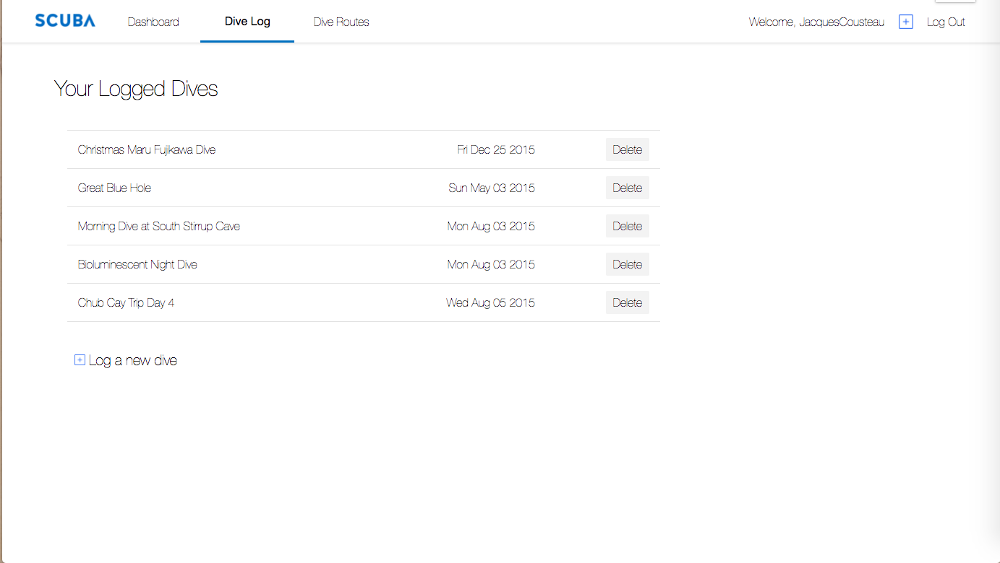

# Scuba

***

[Scuba](http://www.scuba.fitness) is a full-stack web application inspired by Strava, but repurposed to log, map, and track scuba dives and relevant information. Scuba uses a combination of Ruby on Rails for the backend with a PostgreSQL database, and React.js with a Redux architectural framework on the frontend.

## Key Features
***

#### Generating Custom Mapping Routes

  Using the Google Maps API, the route builder enables users to create and save custom scuba diving routes. Clicking the map makes markers akin to google maps directions. Using Google's Place Autocomplete service, users can quickly search for an indicated location.

#### Displaying User Routes

The route index lists a user's saved routes. Each has a small instance of its path projected with the Google Maps API. Route information (title and distance) is displayed below this image.

#### Logging Personal Dives

A core function of Scuba is to enable users to log their dives. Dives can store their distance, duration, air pressure delta, notes, and a title. Users also have the option to store a particular route that a dive followed.

#### Displaying Previous Dives

The dive feed page gives users a quick look that their stored dives. The feed is styled with a clear, straightforward perspective, helping users quickly and accurately interpret the data. Clicking one of the feed items takes the user to a more detailed and enlarged view of that dive.

Additional Resources

   -  [Database Schema](./docs/schema.md)
   -  [API Endpoints](./docs/api-endpoints.md)
   -  [Sample Redux State](./docs/sample-state.md)

## Potential Features

Scuba's core functionality could be improved upon with the following features:

*  Social Networking: users could "friend" other users, enabling messaging, sharing of routes, and the addition of friends' dives on each user's workout feed page.

*  Global Statistics: users could view a global leaderboard and additional stats based on all Scuba users.

*  Edit Routes: users could edit previously saved routes.

*  User Profile Details & Editing: users could view their personal profile statistics, such as account age, and could store and edit additional personal information, such as age, gender, caloric intake, etc.
*  Calendar: users could view a weekly / monthly feed of their workouts.
